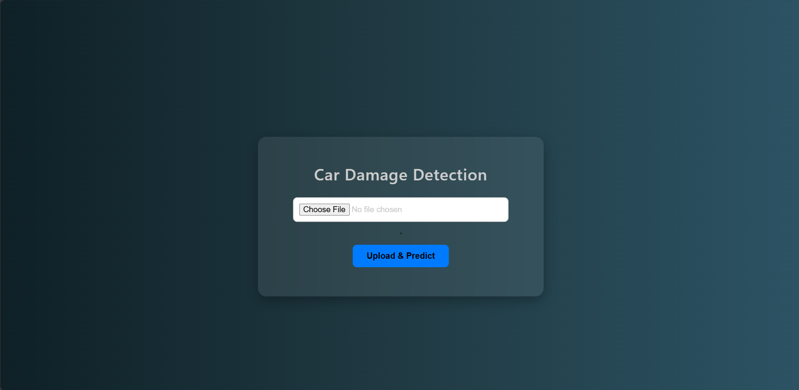
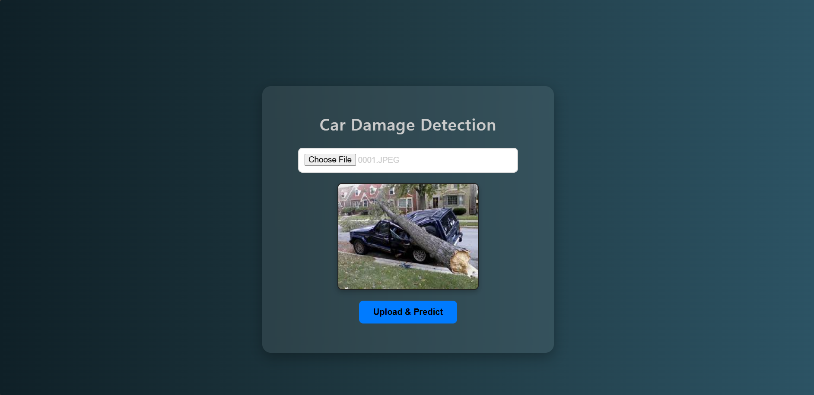
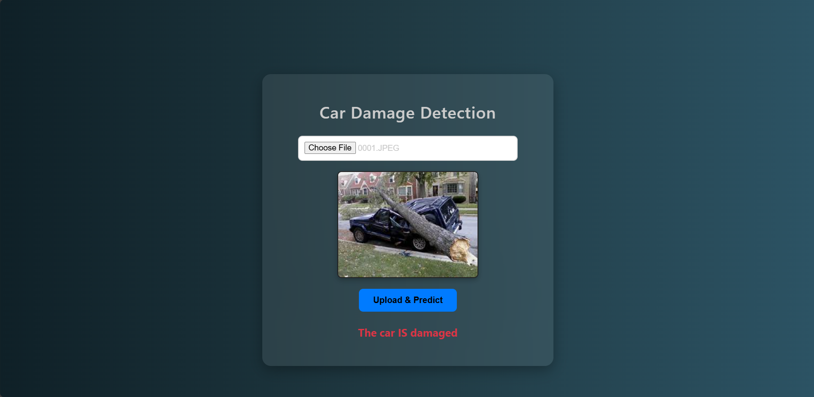

# Car Damage Detection — FastAPI + Web Frontend

This project provides a simple web interface for uploading car images and uses a PyTorch binary classifier (ResNet18) to predict whether a vehicle is damaged or not damaged.

It includes:

- FastAPI backend with a prediction API
- Simple frontend for uploading images
- Trained model with weights included

### Project Structure
```
ROOT/
│
├── backend/
│   ├── entrypoint.py          # FastAPI app
│   └── process.py             # Optional helper
│
├── client/
│   ├── index.html             # Simple upload page
│   └── images_to_test/        # Sample images
│
├── model/
│   ├── res_net.py             # Model architecture & training code
│   ├── modeling.ipynb         # Jupyter notebook for training
│   └── trained_weights/
│       └── model.pth          # Pre-trained weights
│
├── run_server.py              # Starts server + opens browser
├── requirements.txt
└── README.md
```


# Model Information

### A trained model is already included, located at:

`model/trained_weights/model.pth`

This file is loaded automatically when the backend starts.

### If you want to retrain or modify the model:

#### Open the notebook:

`model/modeling.ipynb`

#### Run all cells to train the ResNet model

Save the weights back into:

`model/trained_weights/model.pth`


#### Make sure the filename stays the same
#### Restart the server to load the updated model

This makes it easy to experiment with new training data or improvements.

## How to Run
### 1️. Install dependencies
```
pip install -r requirements.txt
```

### 2. Start the server

#### From the root folder:

```
python run_server.py
```
#### This will:

Start FastAPI backend at http://127.0.0.1:8000

Open the browser to the upload page automatically

## Using the App

1. Select an image using Choose File



2. Click Upload & Predict


3. The prediction appears on screen




#### Example:

Prediction: {"prediction": 1}


#### Where:

|  Value	  |     Meaning     |
|:--------:|:---------------:|
|    0	    |   Not Damaged   |
|    1	    |     Damaged     |

## Technical Notes

- No multipart form upload is used

- Raw binary file data is sent to /predict-image


## Contributors
#### Group ID: 26
- Shiv Amin
- Vibhavan Saibuvis
- Saksham Tejpal
